# Terraform AWS: VPC + EC2 + S3 + IAM

Infrastructure as Code project that provisions a custom VPC, a web server on EC2, a private S3 bucket, and a least-privilege IAM role on AWS, using Terraform.

The full lifecycle was tested: `terraform plan`, `apply`, verification, and `destroy`.

## Architecture

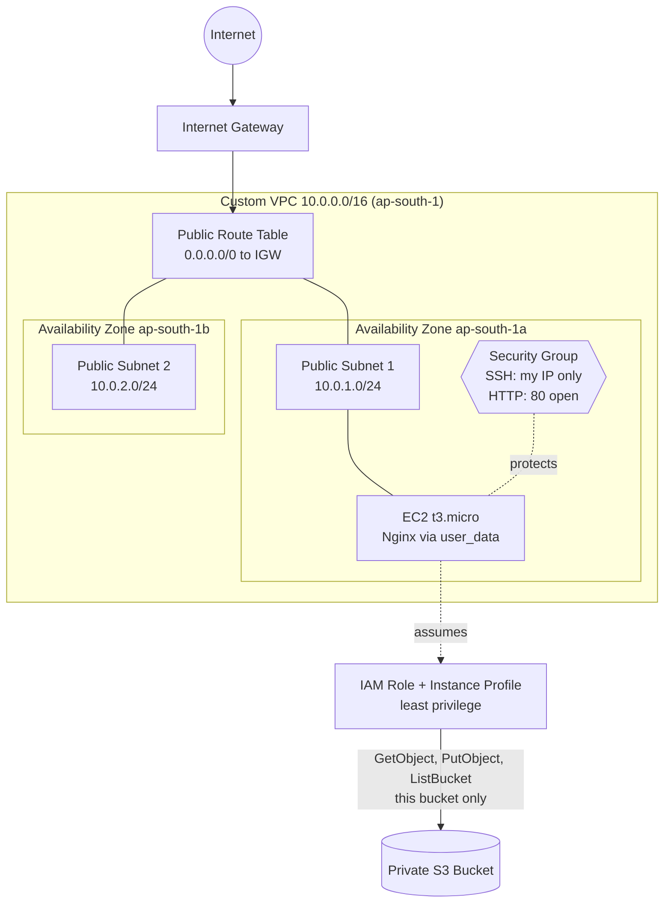

## What gets created

16 AWS resources:

| Resource | Purpose |
|---|---|
| VPC (`10.0.0.0/16`) | Isolated private network with DNS hostnames enabled |
| 2 public subnets | One in `ap-south-1a`, one in `ap-south-1b` |
| Internet Gateway | Connects the VPC to the internet |
| Route table + 2 associations | Sends `0.0.0.0/0` through the Internet Gateway |
| Security group | SSH from my IP only, HTTP open, all outbound allowed |
| Key pair | SSH login to the instance |
| EC2 instance (`t3.micro`) | Amazon Linux 2023, Nginx installed through `user_data` |
| S3 bucket + public access block | Private bucket with a random name suffix |
| IAM role + inline policy + instance profile | Lets EC2 use the bucket without stored access keys |

The AMI is looked up automatically from the AWS SSM public parameter, so no AMI ID is hardcoded.

## Security decisions

- **SSH is restricted to one IP** (`my_ip_cidr`), not `0.0.0.0/0`. The IP lives in `terraform.tfvars`, which is git-ignored.
- **No access keys on the instance.** The EC2 instance gets S3 access through an IAM role and instance profile.
- **Least-privilege IAM policy.** `s3:ListBucket` is allowed on the bucket ARN only. `s3:GetObject` and `s3:PutObject` are allowed on `bucket/*` only. There is no `AmazonS3FullAccess`.
- **The S3 bucket blocks all public access.**
- **State files and secrets are never committed.** `.gitignore` covers `.terraform/`, `*.tfstate*`, and `*.tfvars`.

## Project structure

```
.
├── provider.tf         # Terraform + AWS and random providers
├── variables.tf        # Input variables
├── vpc.tf              # VPC
├── subnets.tf          # Two public subnets in two AZs
├── network.tf          # Internet Gateway, route table, associations
├── security_group.tf   # Security group rules
├── key_pair.tf         # SSH key pair
├── ec2.tf              # AMI lookup + EC2 instance
├── s3.tf               # S3 bucket + public access block
├── iam.tf              # IAM role, policy, instance profile
├── outputs.tf          # VPC, instance IP, bucket name, and more
└── screenshots/        # Proof that it ran
```

## How to run it

**Prerequisites**
- Terraform 1.5 or newer
- AWS CLI configured with an IAM user (`aws configure`)
- An SSH key pair on your machine:

```bash
ssh-keygen -t ed25519 -f ~/.ssh/tf-demo-key -N ""
```

**Steps**

1. Clone the repo:

```bash
git clone https://github.com/MuneebRather/terraform-aws-vpc-ec2-s3.git
cd terraform-aws-vpc-ec2-s3
```

2. Find your public IP and create `terraform.tfvars` (this file is git-ignored):

```bash
curl -4 ifconfig.me
```

```hcl
my_ip_cidr = "YOUR.IP.HERE/32"
```

3. Deploy:

```bash
terraform init
terraform plan
terraform apply
```

4. Test the web server and the S3 access:

```bash
curl http://<instance_public_ip>
ssh -i ~/.ssh/tf-demo-key ec2-user@<instance_public_ip>
```

On the instance:

```bash
echo "hello from ec2" > test.txt
aws s3 cp test.txt s3://<bucket_name>/test.txt --region ap-south-1
aws s3 ls s3://<bucket_name>/ --region ap-south-1
aws s3 ls --region ap-south-1
```

The first two S3 commands succeed. The last one fails with `AccessDenied`, which confirms the role can only reach its own bucket.

5. Clean up so nothing keeps costing money:

```bash
terraform destroy
```

## Inputs and outputs

**Main variables**

| Variable | Default | Description |
|---|---|---|
| `aws_region` | `ap-south-1` | Region to deploy into |
| `project_name` | `tf-demo` | Name prefix for tags |
| `vpc_cidr` | `10.0.0.0/16` | VPC IP range |
| `instance_type` | `t3.micro` | EC2 instance type |
| `my_ip_cidr` | none (required) | My public IP in CIDR format, allowed to SSH |

**Outputs:** `vpc_id`, `public_subnet_1_id`, `public_subnet_2_id`, `internet_gateway_id`, `public_route_table_id`, `security_group_id`, `instance_id`, `instance_public_ip`, `bucket_name`

## Screenshots

**Resources managed by Terraform**

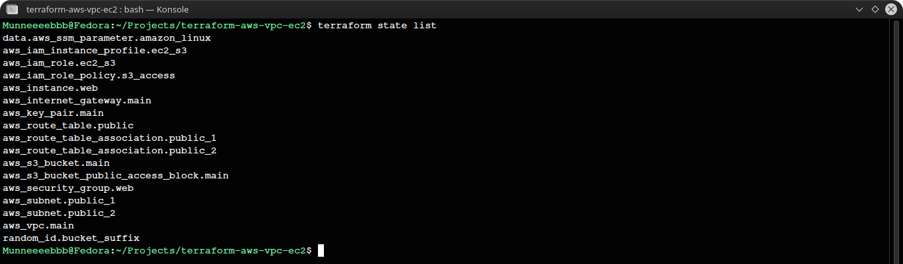

**VPC**

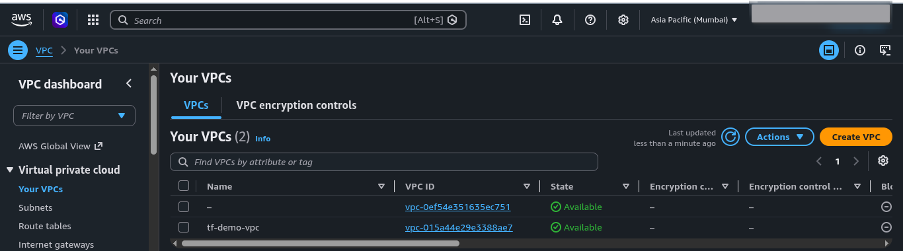

**Subnets in two Availability Zones**

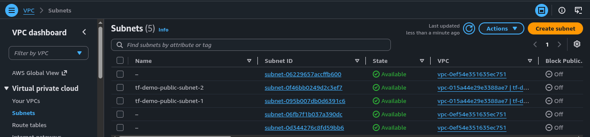

**Internet Gateway**

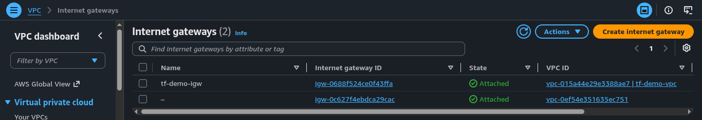

**Route table with subnet associations**

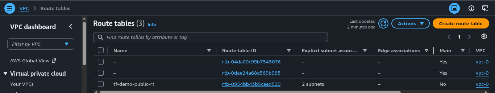

**Security group inbound rules**

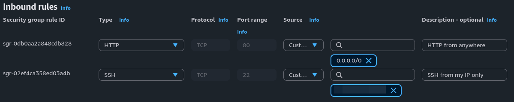

**EC2 instance running**

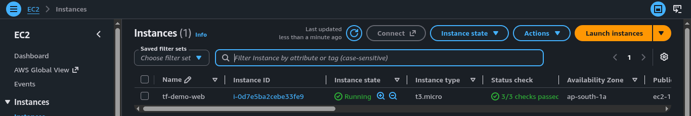

**S3 bucket with uploaded files**

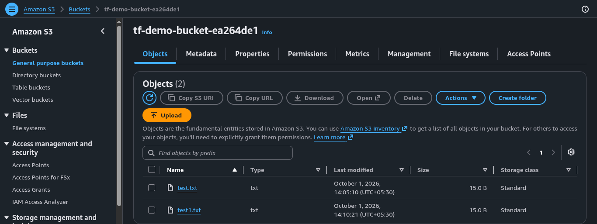

**Least-privilege IAM policy**

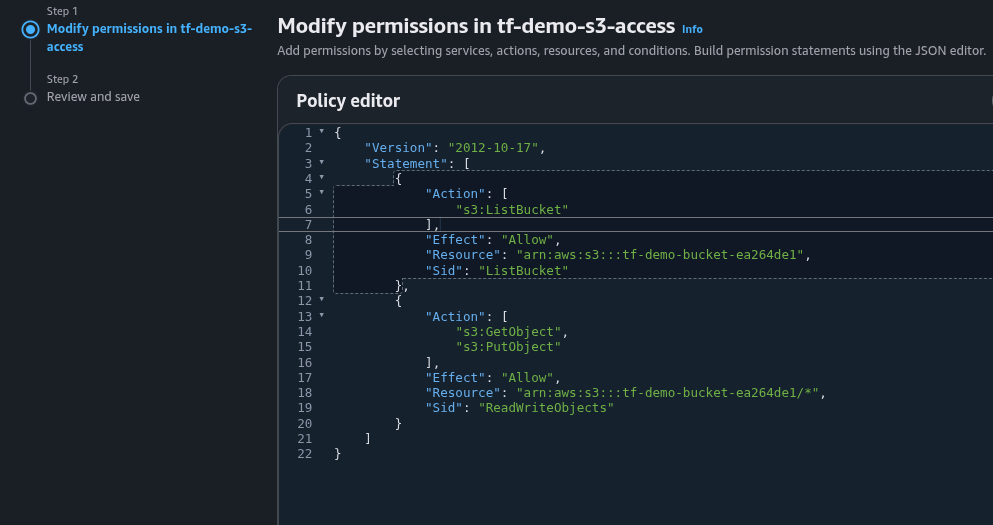

**EC2 to S3 test: upload works, listing all buckets is denied**

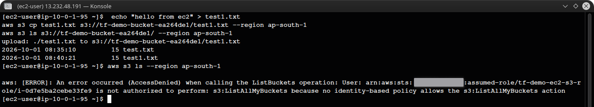

**Clean teardown with `terraform destroy`**

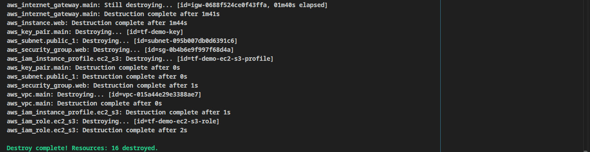

## What I learned

- Building AWS networking from scratch: VPC, subnets, Internet Gateway, route tables, and why a subnet needs a route table association to be public.
- Writing IAM policies scoped to a single resource instead of using managed full-access policies.
- Using instance profiles so EC2 never needs stored credentials.
- Keeping secrets and state out of Git.
- Running the full infrastructure lifecycle: plan, apply, verify, destroy.

## Cost

Everything runs on small, low-cost resources (a `t3.micro` instance, an empty S3 bucket, and free networking components). I ran `terraform destroy` after testing, so nothing is left running.

## Author

Muneeb Rather
[GitHub](https://github.com/MuneebRather)